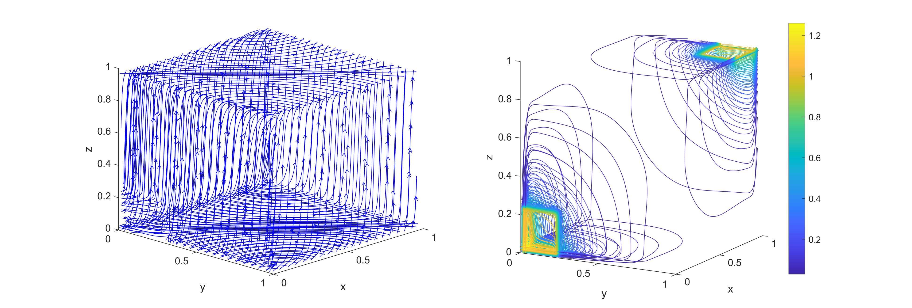
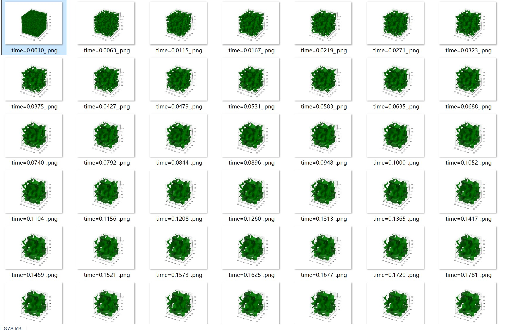

# CavityFlowNumpyOnly
2D Cavity Flow Simulation only depends on python numpy
The Source code and techniques are modified from 
https://github.com/mathworks/2D-Lid-Driven-Cavity-Flow-Incompressible-Navier-Stokes-Solver.git  

This work is a re-implement of matlab work.  

Anything about solving linear equations is replaced by numpy FFT solver  

And the stem of this work can be transplanted into cupy module.  

The 'Stable_CavityFlow_2or3order.py' gives the Crank-Nicolson(2th order) and RK3(3th order)
version in the original manuscripts while 'Euler_forward.py' gives a 1th order
numerical formulation.
The simulation streamlines are as follows:

A cupy version of data parallel version is released in gpuCavityFlow.py
The memory of Nvidia-gpu can be exploited efficiently by solving thousands 
of 2d equations simultaneously.

Now a 3d-cavity simulation with pytorch implement is released and 
the visualization can be completed on Matlab or paraview, the images
derived from [知乎](https://zhuanlan.zhihu.com/p/852110231)

Also a cahn-hilliard-FDM solver has been committed 
compromising 2d and 3d implements
https://github.com/wangsu2000/CavityFlowNumpyOnly/edit/main/bubble_merge.mp4

